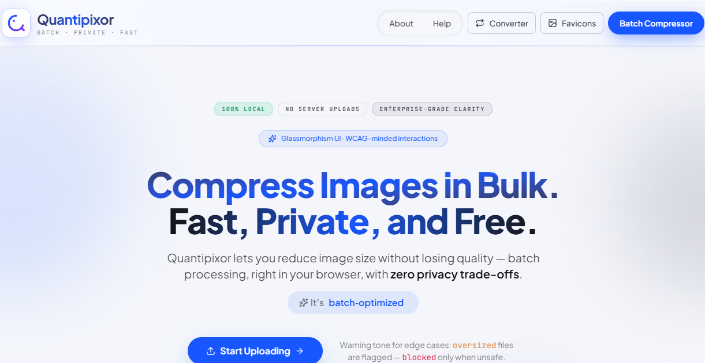
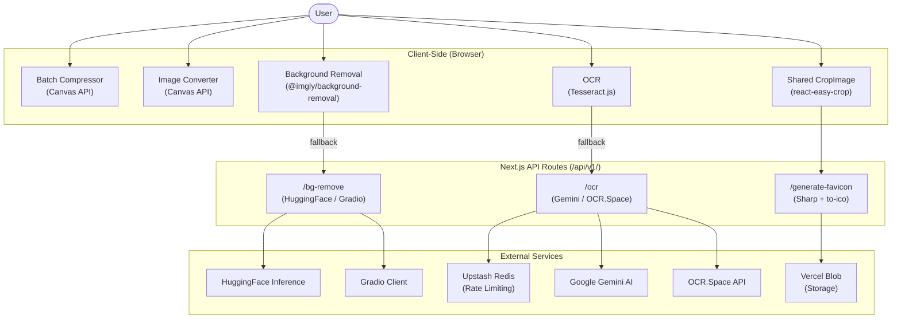

<div align="center">  
  
  
  
# Quantipixor  
  
**A high-performance, privacy-first image processing suite — built for the modern web.**  
  
Compress, convert, remove backgrounds, extract text, and generate favicons.    
All in one place. Most tools run entirely in your browser.  
  
[](https://quantipixor.vercel.app/)  
[](https://nextjs.org/)  
[](https://react.dev/)  
[](https://www.typescriptlang.org/)  
[](LICENSE)  
  
[Live Demo](https://quantipixor.vercel.app/) · [Report Bug](https://github.com/ByteCrister/quantipixor/issues) · [Request Feature](https://github.com/ByteCrister/quantipixor/issues)  
  
</div>  
  
---  
  
## Table of Contents  
  
- [About](#about)  
- [Feature Suite](#feature-suite)  
- [How It Works](#how-it-works)  
- [Tech Stack](#tech-stack)  
- [Project Structure](#project-structure)  
- [Getting Started](#getting-started)  
- [Environment Variables](#environment-variables)  
- [Configuration & Limits](#configuration--limits)  
- [ZIP Output Structure](#zip-output-structure)  
- [API Routes](#api-routes)  
- [Supported Formats](#supported-formats)  
- [Roadmap](#roadmap)  
- [Contributing](#contributing)  
- [License](#license)  
- [Author](#author)  
  
---  
  
## About  
  
Quantipixor started as a batch image compressor and has evolved into a comprehensive **multi-tool image processing suite**. It is built on a hybrid processing model: privacy-sensitive operations (compression, conversion, background removal) run entirely client-side in the browser, while tasks requiring binary manipulation or AI inference (favicon generation, OCR, server-side AI) are handled through secure Next.js API routes.  
  
Built with **Next.js 16**, **React 19**, and a **Glassmorphism design system**, Quantipixor delivers a polished, accessible experience on any modern browser — with zero data leaving your device for core operations.  
  
---  
  
## Feature Suite  
  
### 1. Batch Image Compressor  
> 100% client-side — your images never leave your device.  
  
| Feature | Detail |  
|---|---|  
| **Client-Side Processing** | Compression via the HTML Canvas API — no server uploads |  
| **Batch Upload** | Up to 20 images per drop, 50 images in the queue simultaneously |  
| **Smart Deduplication** | SHA-256 file hashing prevents duplicate uploads |  
| **Configurable Quality** | Adjust from 20% to 80% (default: 70%) |  
| **ZIP Download** | All compressed images packaged into organized `batch-N/` sub-folders |  
| **Custom Naming** | Set a base filename and batch size for output file naming |  
| **Real-Time Progress** | Per-image status tracking: `pending → processing → completed / error` |  
| **Re-Compress** | Keep files in queue and re-compress with different settings |  
| **Upload Feedback** | Stats on every upload: added, duplicates skipped, invalid, truncated |  
  
---  
  
### 2. Image Converter  
> Convert between image formats entirely in the browser.  
  
- Convert across JPEG, PNG, WebP, AVIF, and other formats  
- Interactive crop tool with aspect ratio presets powered by `react-easy-crop`  
- Shared `CropImage` component reused across tools for a consistent UX  
  
---  
  
### 3. AI Background Removal  
> Remove image backgrounds using on-device AI or server-side inference.  
  
- Powered by **`@imgly/background-removal`** for in-browser inference  
- Fallback to **HuggingFace Inference API** (`@huggingface/inference`) and **Gradio** (`@gradio/client`) for server-side processing  
- Dedicated API route at `/api/v1/bg-remove/`  
- Shared cropping interface for post-removal refinement  
  
---  
  
### 4. OCR Document Formatter  
> Extract text from images and export as formatted documents.  
  
- **Multi-provider OCR** with automatic rotation:  
  - **Google Gemini** (`@google/genai`) — primary AI provider  
  - **OCR.Space** — fallback REST API  
  - **Tesseract.js** — fully client-side OCR engine  
- **Multi-language support**: English, Bengali, Arabic, Hindi, Spanish  
- **Document export**: Download extracted text as `.docx` via `docx` and `html-docx-js`  
- **Redis-based rate limiting** via Upstash to protect API quotas  
- API route at `/api/v1/ocr/`  
  
---  
  
### 5. Favicon Generator  
> Generate production-ready `.ico` favicons from any image.  
  
- Upload and interactively crop your source image  
- Server-side processing with **Sharp** for high-quality resizing  
- `.ico` packaging via **`to-ico`** and **`icojs`**  
- Generates multi-resolution favicon sets  
- API route at `/api/v1/generate-favicon/`  
  
---  
  
### Cross-Cutting Capabilities  
  
| Capability | Detail |  
|---|---|  
| **Glassmorphism UI** | Frosted glass aesthetic with translucent layers, backdrop blur, and luminous borders |  
| **Dark / Light Mode** | System-preference-aware theme with CSS variable tokens |  
| **Accessibility** | WCAG 2.2 AA compliant — keyboard-first interactions, visible focus states |  
| **SEO Optimized** | Full Open Graph, Twitter Card, and JSON-LD structured data |  
| **Animations** | Purposeful motion via Framer Motion and `react-type-animation` |  
| **Toast Notifications** | Global toast system via a dedicated Zustand store |  
  
---  
  
## How It Works  
  

  
---  
  
## Tech Stack  
  
| Layer | Technology |  
|---|---|  
| **Framework** | [Next.js 16](https://nextjs.org/) (App Router) |  
| **UI Library** | [React 19](https://react.dev/) |  
| **Language** | TypeScript 5 |  
| **State Management** | [Zustand 5](https://zustand-demo.pmnd.rs/) |  
| **Styling** | [Tailwind CSS v4](https://tailwindcss.com/) · Glassmorphism design system |  
| **UI Primitives** | [Radix UI](https://www.radix-ui.com/) (Dialog, AlertDialog, Slot) |  
| **Animations** | [Framer Motion](https://www.framer.com/motion/) · `react-type-animation` |  
| **Icons** | [Lucide React](https://lucide.dev/) · [React Icons](https://react-icons.github.io/react-icons/) |  
| **Image Cropping** | [react-easy-crop](https://github.com/ValentinH/react-easy-crop) |  
| **ZIP Generation** | [JSZip](https://stuk.github.io/jszip/) |  
| **Server Image Processing** | [Sharp](https://sharp.pixelplumbing.com/) |  
| **Favicon Packaging** | [to-ico](https://github.com/kevva/to-ico) · [icojs](https://github.com/egy186/icojs) |  
| **OCR (Client)** | [Tesseract.js](https://tesseract.projectnaptha.com/) |  
| **OCR (Server)** | [Google Gemini](https://ai.google.dev/) · [OCR.Space](https://ocr.space/) |  
| **Background Removal** | [@imgly/background-removal](https://github.com/imgly/background-removal-js) · [HuggingFace](https://huggingface.co/) · [Gradio](https://www.gradio.app/) |  
| **AI (Additional)** | [Groq SDK](https://groq.com/) |  
| **Rate Limiting** | [Upstash Redis](https://upstash.com/) |  
| **Storage** | [Vercel Blob](https://vercel.com/docs/storage/vercel-blob) |  
| **Document Export** | [docx](https://docx.js.org/) · [html-docx-js](https://github.com/evidenceprime/html-docx-js) |  
| **Typography** | Plus Jakarta Sans (primary) · JetBrains Mono (monospace) |  
  
---  
  
## Project Structure  
  
```  
quantipixor/  
├── public/  
│   └── og-images/              # Open Graph images  
├── src/  
│   ├── app/                    # Next.js App Router  
│   │   ├── about/              # About page  
│   │   ├── help/               # Help & documentation page  
│   │   ├── image/              # Image tools hub  
│   │   │   ├── batch-compressor/   # Batch compression tool  
│   │   │   ├── converter/          # Image format converter  
│   │   │   ├── remove-bg/          # AI background removal  
│   │   │   ├── ocr-doc-formatter/  # OCR document formatter  
│   │   │   └── generate-favicon/   # Favicon generator  
│   │   ├── api/  
│   │   │   ├── v1/  
│   │   │   │   ├── ocr/            # OCR API (Gemini / OCR.Space)  
│   │   │   │   ├── bg-remove/      # Background removal API  
│   │   │   │   └── generate-favicon/  # Favicon generation API  
│   │   │   └── test/               # Test routes  
│   │   ├── layout.tsx          # Root layout (fonts, header, footer)  
│   │   ├── page.tsx            # Landing page with SEO & JSON-LD  
│   │   ├── globals.css         # Global styles & design tokens  
│   │   ├── robots.ts           # robots.txt generation  
│   │   └── sitemap.ts          # sitemap.xml generation  
│   ├── components/  
│   │   ├── about/              # About page components  
│   │   ├── global/             # Shared components (Loading, QuantipixorIcon)  
│   │   ├── help/               # Help page components  
│   │   ├── image/  
│   │   │   ├── batch-compressor/   # Compressor UI (DropZone, ImageList, etc.)  
│   │   │   ├── converter/          # Converter UI  
│   │   │   ├── generate-favicon/   # Favicon UI (CropImage)  
│   │   │   ├── ocr-doc-formatter/  # OCR UI (OutputPanel, LanguageSelector)  
│   │   │   └── remove-bg/          # Background removal UI  
│   │   ├── landing/            # Landing page sections (Hero, Features)  
│   │   ├── layout/             # Header & Footer  
│   │   └── ui/                 # Reusable primitives (Button, Card, Dialog, Badge, Toaster)  
│   ├── config/                 # App-level configuration  
│   ├── const/  
│   │   ├── image-extensions.ts     # 18 extensions, MIME maps, validation helpers  
│   │   ├── imageCompressorLimits.ts # Upload & queue limits  
│   │   ├── languages.ts            # OCR language codes (eng, ben, ara, hin, spa)  
│   │   └── social-links.ts         # Creator social links  
│   ├── fonts/                  # Local font assets  
│   ├── hooks/  
│   │   └── useImageCompressor.ts   # Custom hook for compressor logic  
│   ├── lib/                    # Shared utility helpers  
│   ├── store/  
│   │   ├── imageCompressorStore.ts # Zustand store (state + actions)  
│   │   └── toastStore.ts           # Global toast notification store  
│   ├── types/  
│   │   ├── index.ts            # Core interfaces (ImageItem, CompressionConfig, etc.)  
│   │   └── ocr-space.ts        # OCR.Space API response types  
│   └── utils/  
│       └── image/  
│           ├── compressors/    # Canvas-based compression engine  
│           ├── converters/     # Format conversion utilities  
│           ├── favicons/       # Favicon generation helpers  
│           ├── ocr/            # OCR processing utilities  
│           └── rmbg/           # Background removal utilities  
├── AGENTS.md                   # Next.js agent rules  
├── CLAUDE.md                   # Glassmorphism design system guidelines  
├── next.config.ts  
├── postcss.config.mjs  
├── eslint.config.mjs  
├── tsconfig.json  
└── package.json  
```  
  
---  
  
## Getting Started  
  
### Prerequisites  
  
- **Node.js** >= 18  
- **npm**, **yarn**, **pnpm**, or **bun**  
  
### Installation  
  
```bash  
# Clone the repository  [header-1](#header-1)
git clone https://github.com/ByteCrister/quantipixor.git  
cd quantipixor  
  
# Install dependencies  [header-2](#header-2)
npm install  
  
# Copy the environment template and fill in your values  [header-3](#header-3)
cp .env.example .env.local  
  
# Start the development server  [header-4](#header-4)
npm run dev  
```  
  
Open [http://localhost:3000](http://localhost:3000) in your browser.  
  
### Available Scripts  
  
| Command | Description |  
|---|---|  
| `npm run dev` | Start the development server |  
| `npm run build` | Create a production build |  
| `npm run start` | Start the production server |  
| `npm run lint` | Run ESLint |  
  
---  
  
## Environment Variables  
  
Create a `.env.local` file in the project root. Variables marked **required** are needed for the corresponding feature to function.  
  
| Variable | Feature | Required | Description |  
|---|---|---|---|  
| `NEXT_PUBLIC_SITE_URL` | SEO / JSON-LD | Yes | Canonical site URL (e.g. `https://quantipixor.vercel.app`) |  
| `GOOGLE_GEMINI_API_KEY` | OCR | For OCR | Google Gemini API key for AI-powered OCR |  
| `OCR_SPACE_API_KEY` | OCR | For OCR | OCR.Space API key (fallback OCR provider) |  
| `GROQ_API_KEY` | AI | Optional | Groq API key for additional AI inference |  
| `UPSTASH_REDIS_REST_URL` | Rate Limiting | For OCR API | Upstash Redis REST URL |  
| `UPSTASH_REDIS_REST_TOKEN` | Rate Limiting | For OCR API | Upstash Redis REST token |  
| `BLOB_READ_WRITE_TOKEN` | Storage | For Favicon API | Vercel Blob read/write token |  
| `HUGGINGFACE_API_KEY` | Background Removal | For BG Remove API | HuggingFace Inference API key |  
  
> **Note:** The Batch Compressor, Image Converter, and client-side Background Removal (`@imgly/background-removal`) work with **no environment variables**. Only the server-side API features (OCR, Favicon, server-side BG removal) require the above keys.  
  
---  
  
## Configuration & Limits  
  
### Batch Compressor  
  
| Setting | Range | Default | Description |  
|---|---|---|---|  
| **Quality** | 0.2 – 0.8 | 0.7 | Compression quality (affects JPEG & WebP output) |  
| **Batch Size** | 1 – 100 | 10 | Images per sub-folder in the ZIP |  
| **Base Name** | any string | `"image"` | Prefix for output filenames |  
| **Max File Size** | — | 15 MB | Individual file size limit |  
| **Per Upload** | — | 20 | Max images accepted per file picker / drop |  
| **Total Queue** | — | 50 | Max images in the queue at once |  
  
### OCR Languages  
  
| Language | Code |  
|---|---|  
| English | `eng` |  
| Bengali | `ben` |  
| Arabic | `ara` |  
| Hindi | `hin` |  
| Spanish | `spa` |  
  
---  
  
## ZIP Output Structure  
  
```  
compressed-images-<timestamp>.zip  
├── batch-1/  
│   ├── image-1.jpg  
│   ├── image-2.png  
│   └── image-3.webp  
├── batch-2/  
│   ├── image-1.jpg  
│   └── image-2.png  
└── ...  
```  
  
Files are named `{baseName}-{sequenceWithinBatch}.{extension}` and grouped into `batch-{N}/` folders based on the configured batch size.  
  
---  
  
## API Routes  
  
All server-side routes are versioned under `/api/v1/`.  
  
| Route | Method | Description |  
|---|---|---|  
| `POST /api/v1/ocr` | POST | Extract text from an image using Gemini or OCR.Space with Redis rate limiting |  
| `POST /api/v1/bg-remove` | POST | Remove image background via HuggingFace or Gradio inference |  
| `POST /api/v1/generate-favicon` | POST | Generate a multi-resolution `.ico` favicon using Sharp and `to-ico` |  
  
---  
  
## Supported Formats  
  
Quantipixor accepts **18 image extensions** across **20+ MIME types**:  
  
| Category | Formats |  
|---|---|  
| **JPEG family** | `.jpg`, `.jpeg`, `.jfif`, `.pjpeg` |  
| **PNG family** | `.png`, `.apng` |  
| **Modern formats** | `.webp`, `.avif`, `.heic`, `.heif` |  
| **Legacy / Other** | `.gif`, `.bmp`, `.svg`, `.ico`, `.cur`, `.tiff`, `.tif` |  
  
> **Note:** The Canvas API reliably re-encodes to **JPEG**, **WebP**, and **PNG** only. All other input formats are rasterized to PNG during compression. Browser support for decoding HEIC/HEIF varies.  
  
---  
  
## Roadmap  
  
- [x] Batch image compression with quality control  
- [x] ZIP download with organized batch folders  
- [x] SHA-256 duplicate detection  
- [x] Drag & drop + file picker upload  
- [x] Real-time compression progress  
- [x] Re-compress with different settings  
- [x] SEO optimization (Open Graph, Twitter Cards, JSON-LD)  
- [x] WCAG 2.2 AA accessibility  
- [x] **Image Format Converter** — Convert between formats (PNG → WebP, HEIC → JPEG, etc.)  
- [x] **AI Background Removal** — Client-side and server-side AI background removal  
- [x] **OCR Document Formatter** — Extract text from images and export as `.docx`  
- [x] **Favicon Generator** — Generate multi-resolution `.ico` favicons from any image  
- [x] **Multi-language OCR** — English, Bengali, Arabic, Hindi, Spanish  
- [x] **Dark / Light Theme** — System-preference-aware theme  
- [ ] **Image Resizer** — Resize by dimensions, percentage, or aspect ratio with presets  
- [ ] **Bulk Resize + Compress** — Combined resize and compress pipeline  
- [ ] **Image Metadata Viewer / Stripper** — View and strip EXIF, IPTC, and XMP metadata  
- [ ] **Watermark Tool** — Add text or image watermarks with position, opacity, and size controls  
- [ ] **Before/After Preview** — Side-by-side or slider comparison of original vs. processed  
- [ ] **Compression Presets** — Save and load named quality/format/size presets  
- [ ] **PWA Support** — Installable progressive web app with offline capability  
- [ ] **Web Worker Compression** — Non-blocking compression for large batches  
- [ ] **Drag-to-Reorder Queue** — Reorder images in the queue before processing  
- [ ] **Individual Image Settings** — Per-image quality and format overrides  
- [ ] **Cloud Export** — One-click export to Google Drive, Dropbox, or clipboard  
  
---  
  
## Contributing  
  
Contributions are welcome! Please follow these steps:  
  
1. Fork the repository  
2. Create a feature branch (`git checkout -b feature/amazing-feature`)  
3. Commit your changes (`git commit -m 'Add amazing feature'`)  
4. Push to the branch (`git push origin feature/amazing-feature`)  
5. Open a Pull Request  
  
Please ensure your code passes linting (`npm run lint`) and follows the existing code style and Glassmorphism design guidelines documented in `CLAUDE.md`.  
  
---  
  
## License  
  
Distributed under the **MIT License**. See `LICENSE` for more information.  
  
---  
  
## Author  
  
**Sadiqul Islam Shakib**  
  
[](https://github.com/ByteCrister)  
[](https://www.linkedin.com/in/sadiqul-islam-shakib)  
[](https://www.facebook.com/sadiqulislam.shakib.33)  
[](https://www.instagram.com/_sadiqul_islam_shakib_)  
  
---  
  
<div align="center">  
  
**If you find Quantipixor useful, please consider giving it a ⭐**  
  
</div>